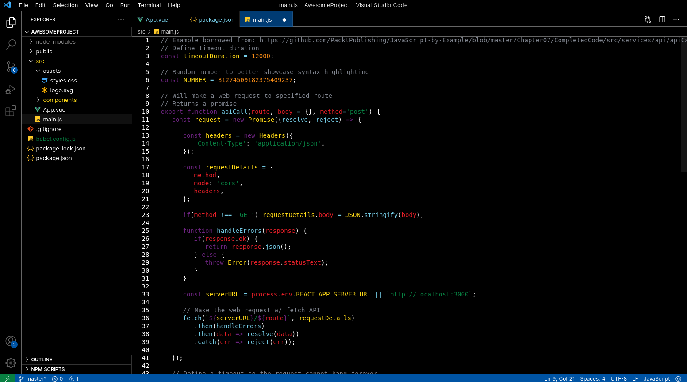
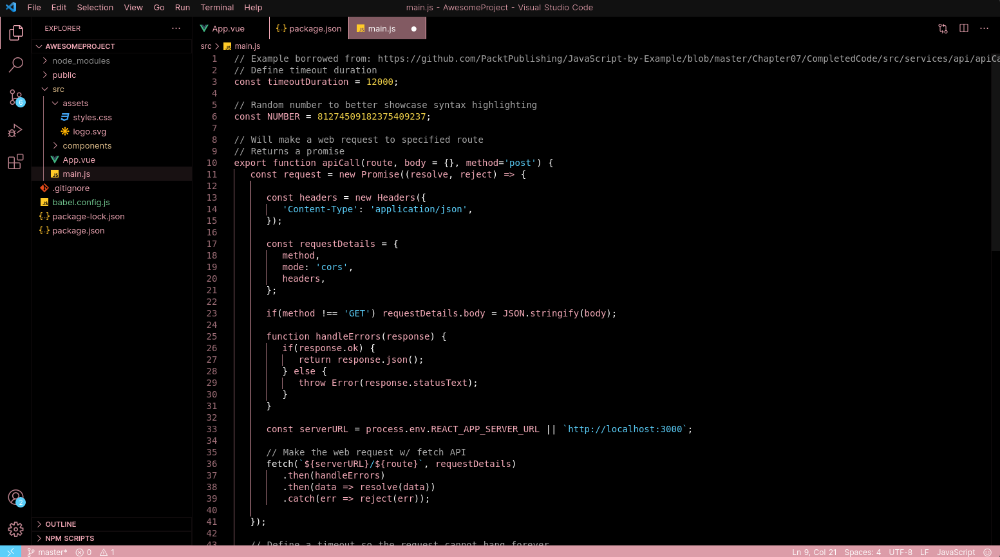
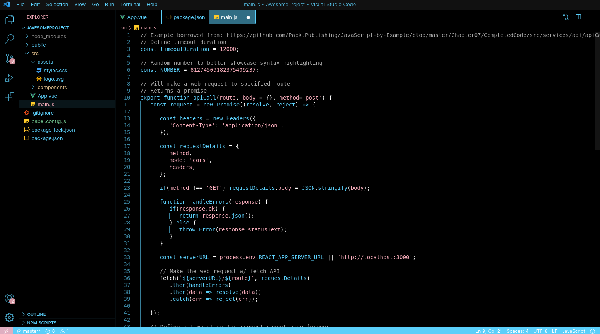
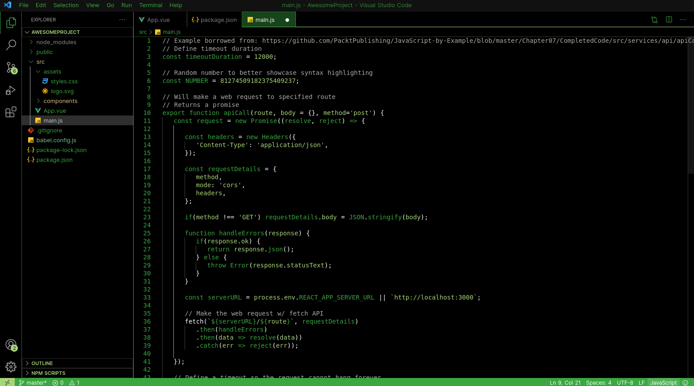
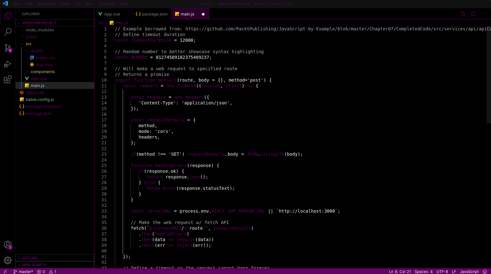
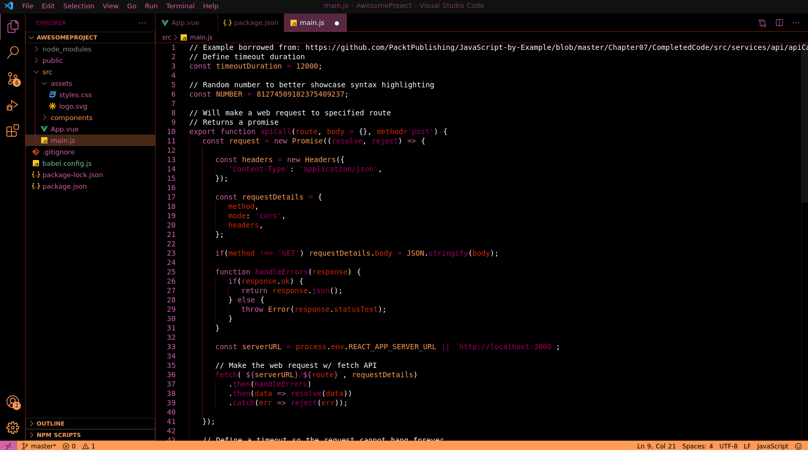
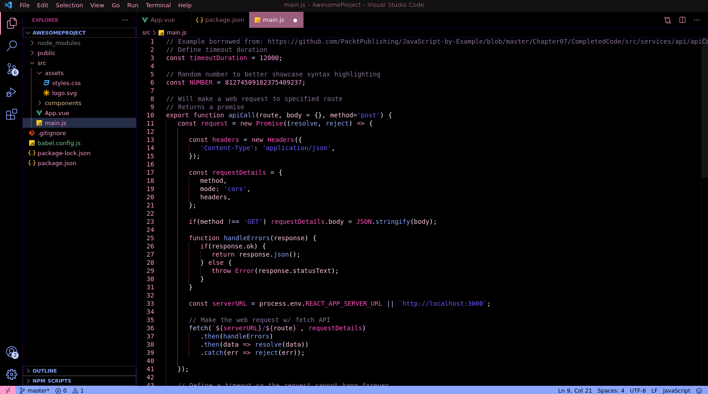
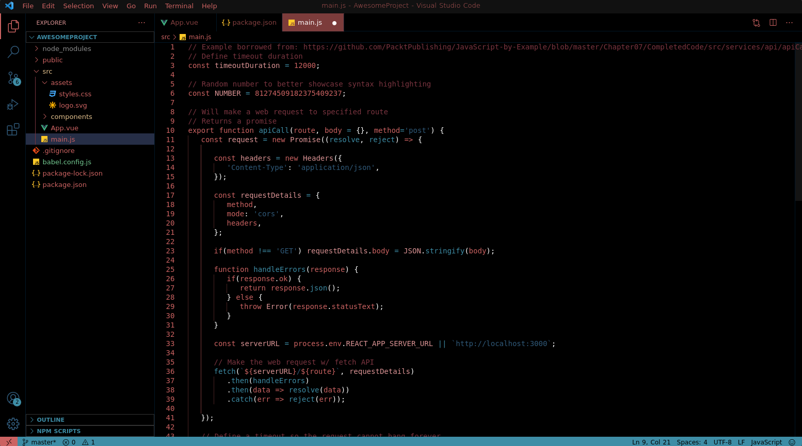

# Eliza's Pride Themes

All themes made with [themes.vscode.one](https://themes.vscode.one/)

Color themes based on various pride flags, made in my personal style. If there is a specific flag that you would like to see a theme of, feel free to shoot me an email or open an issue on GitHub and I'd love to take a crack at it!\
[Feedback is welcome!](https://github.com/The-Gamer69/elizas-pride-themes/issues)

## Examples

### Progress Pride

### Trans (Pink)

### Trans (Blue)

### Aromantic

### Asexual

### Lesbian

### Omnisexual

### Nebularomantic

## Installation

### Automatic

Go to the [VSCode Marketplace](https://marketplace.visualstudio.com/items?itemName=ElizaMuss.elizas-pride-themes) and click the install button on the top of the site. You should be prompted to open VSCode in order to install the extension.

### Manual

If you really want to install this extention manually, you can clone the files from the [GitHub repository](https://github.com/The-Gamer69/elizas-pride-themes). After that, copy it into `<user home>/.vscode/extensions` folder on Linux (or `<install path>\Microsoft VS Code\resources\app\extensions` on Windows) and restart VSCode.

### **Enjoy!**
