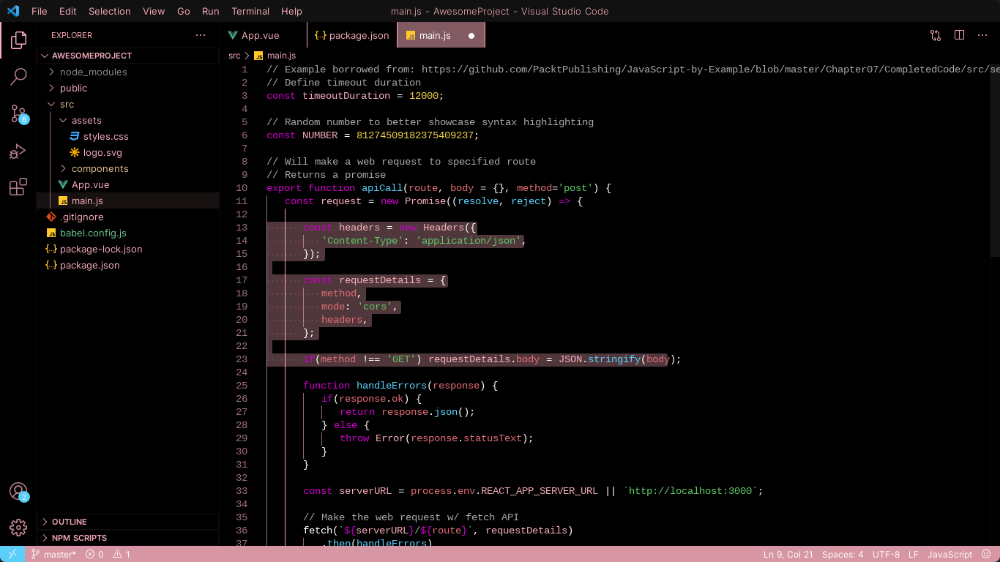
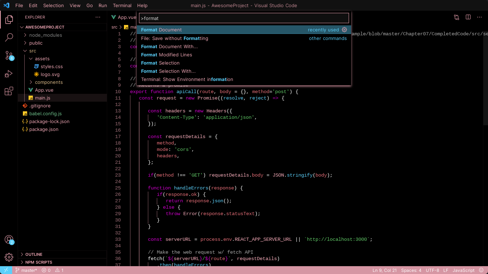
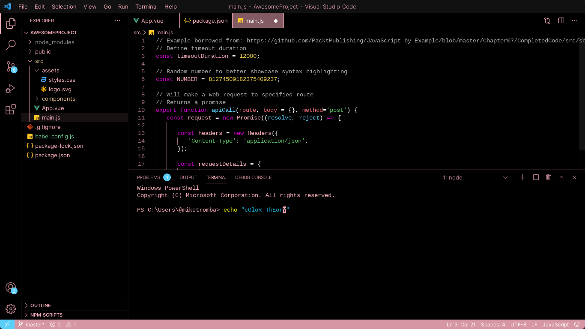
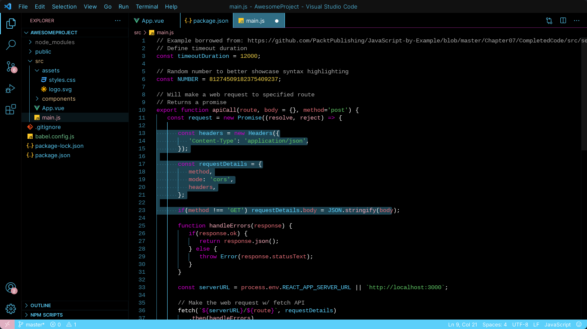
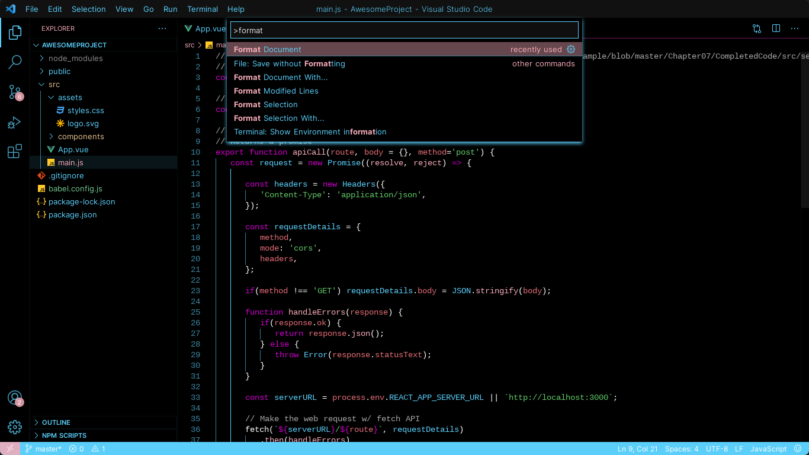
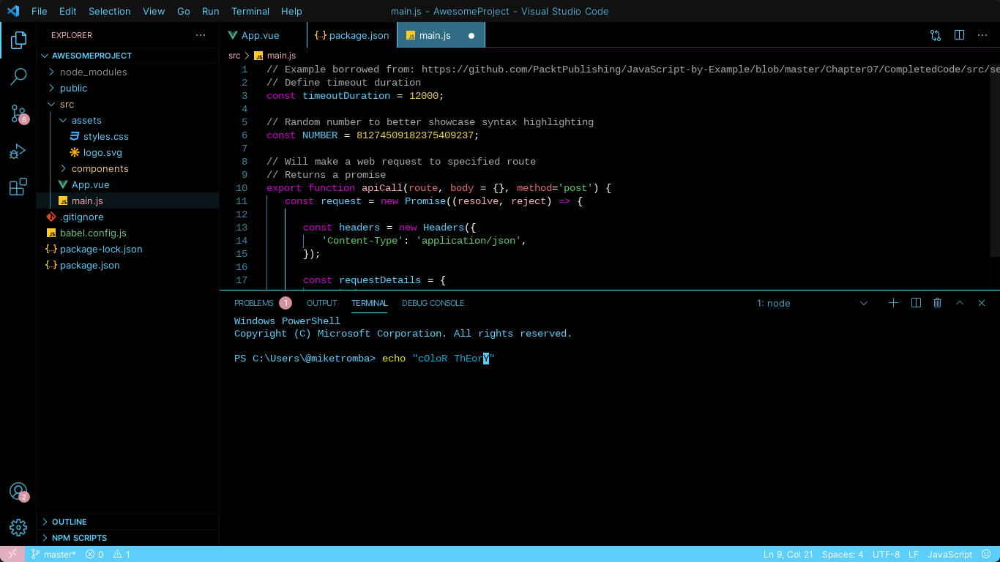
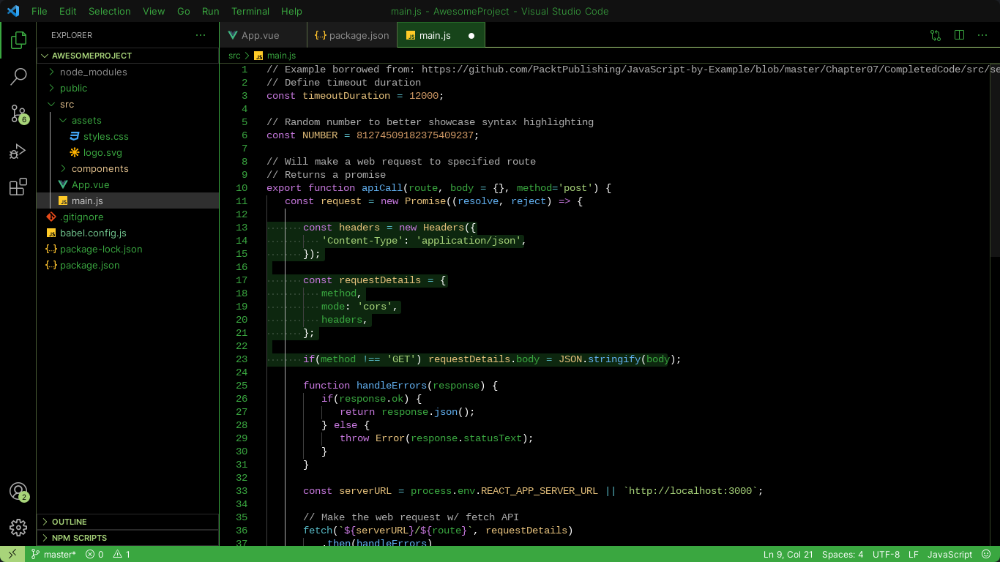
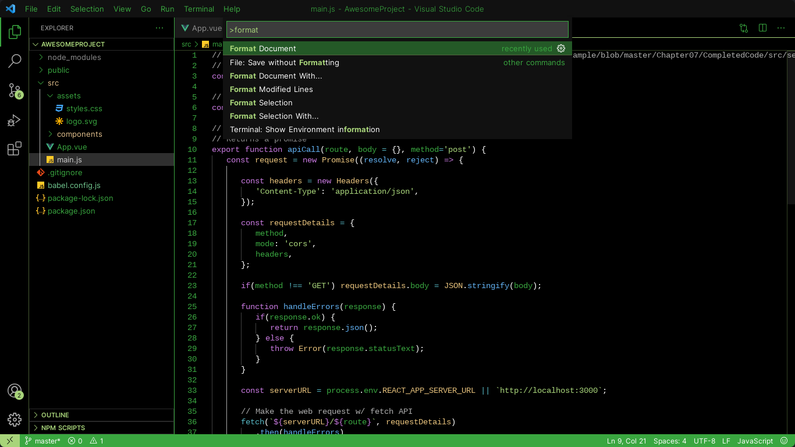
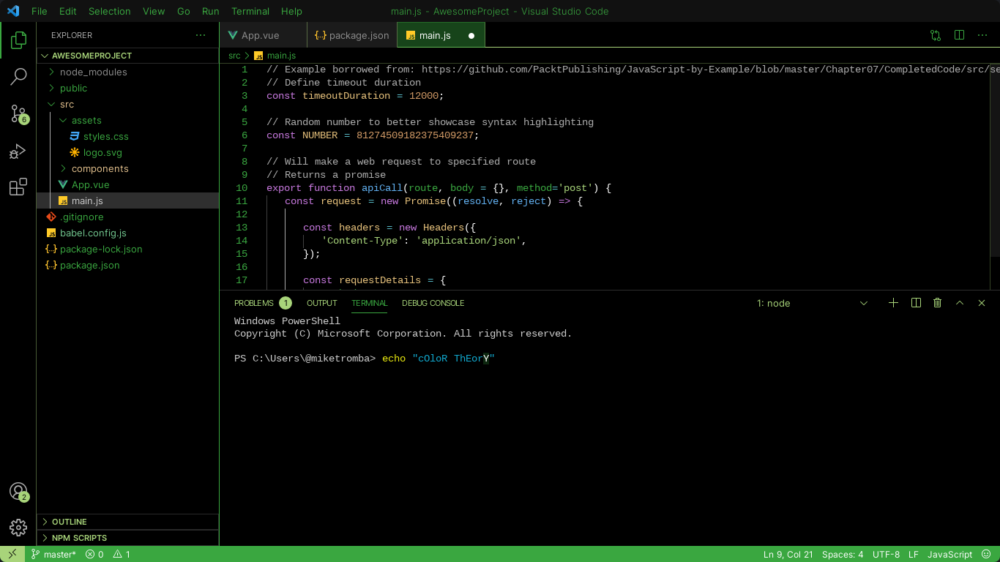

# Eliza's Pride Themes

Color themes based on various pride flags that reperesent me, made in my personal style.\
[Feedback is welcome!](https://github.com/The-Gamer69/elizas-pride-themes/issues)

## Examples

### Trans (Pink)

### Trans (Blue)

### Aromantic

## Installation

### Automatic

Go to the [VSCode Marketplace](https://marketplace.visualstudio.com/items?itemName=ElizaMuss.elizas-pride-themes) and click the install button on the top of the site. You should be prompted to open VSCode in order to install the extension.

### Manual

If you really want to install this extention manually, you can clone the files from the [GitHub repository](https://github.com/The-Gamer69/elizas-pride-themes). After that, copy it into `<user home>/.vscode/extensions` folder on Linux (or `<path you choose on install>\Microsoft VS Code\resources\app\extensions` on Windows) and restart VSCode.

### **Enjoy!**
